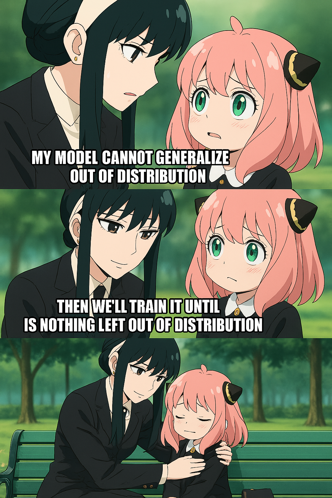
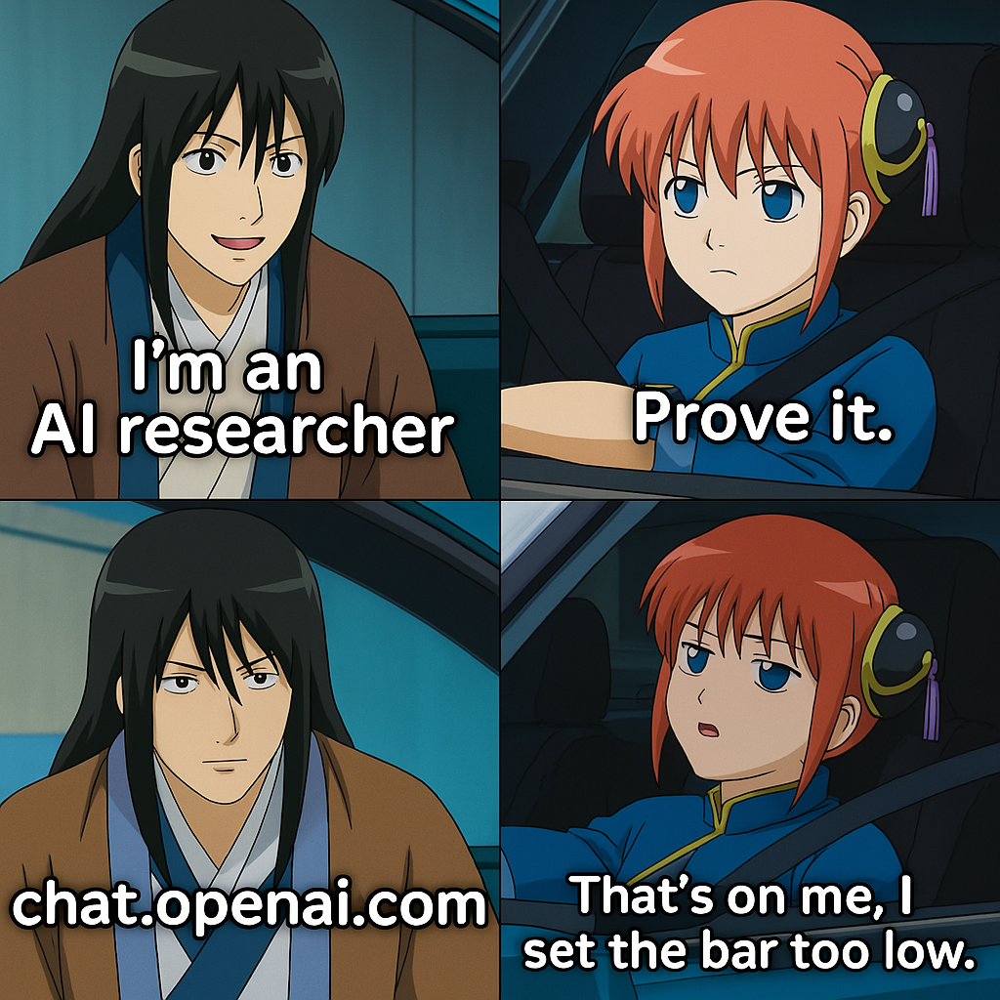

### Hi there 👋 

<!--  -->

<!--  -->

<!--  -->

<!--  -->

<!--  -->

### 📬 Find me at

<!-- ### About me... 

I'm an **RA 💻** 

interested in [Reliable AI](https://github.com/MinghuiChen43/awesome-trustworthy-deep-learning) and [Deep Phenomena](https://github.com/MinghuiChen43/awesome-deep-phenomena). 

I'm currently working on 
  - LLM Agent
  - Reliable AI
  - AI for Healthcare -->
